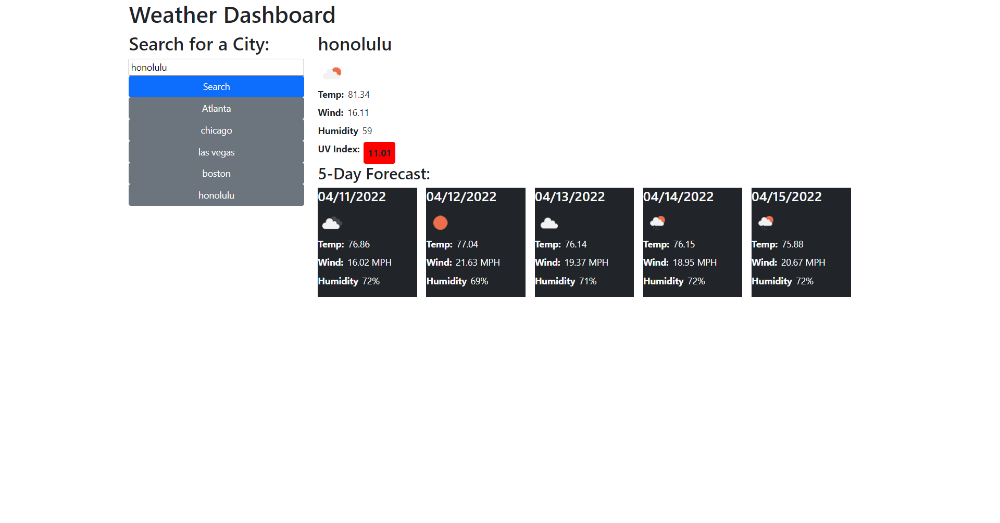

# 06-Server-Side-APIs-Weather-Dashboard

## Description 

The purpose of this program is to simulate the functionality of a weather dashboard using api's to communicate with the front end and back end server. This program's functionality allows you to input a city and in response, receive weather conditions of that city. It utilizes local storage as well to save your recently selected values from the search box in the browser.

## Mock-Up

The following image shows a demonstration of what the finished web application's presentation and functionality will include:

## Prerequisites

Before you continue, make sure you have the following requirements:

- You have Visual Studio Code downloaded.
- You are using a MAC OS or Windows machine.
- You have a basic understanding of HTML and CSS.
- You have a basic understanding of JavaScript.
- You have a basic understanding of web api's.

## Links

[This is a URL link to the deployed application.](https://bungycode.github.io/06-Server-Side-APIs-Weather-Dashboard/)

[This is a URL link to the github repository](https://github.com/Bungycode/06-Server-Side-APIs-Weather-Dashboard)